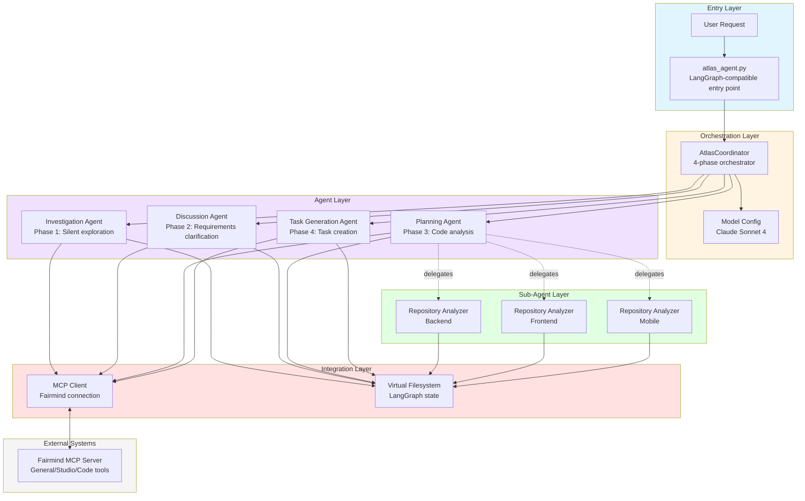
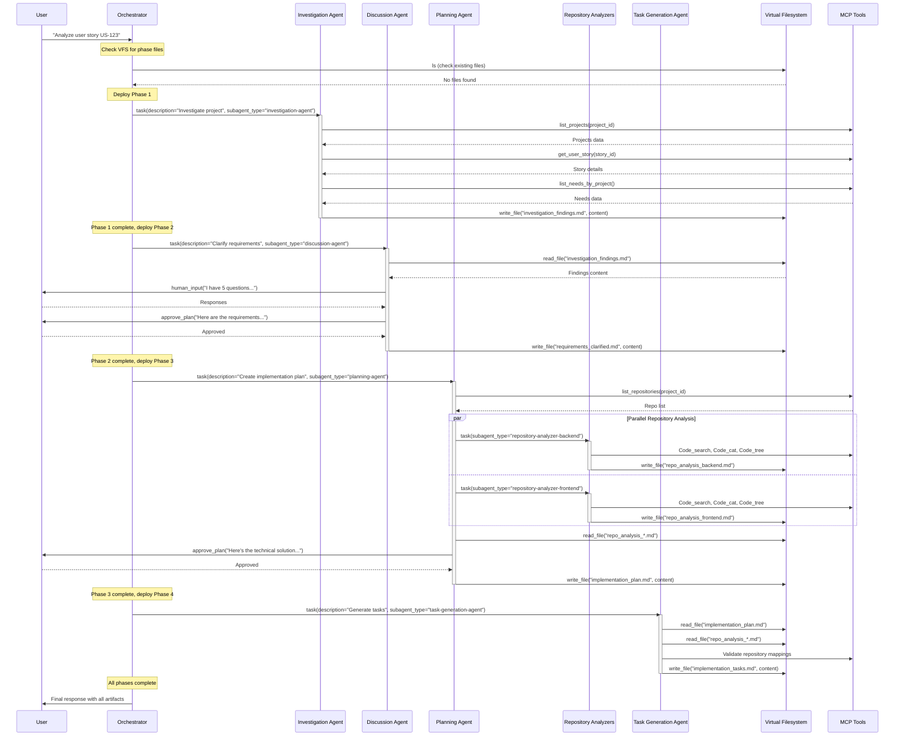
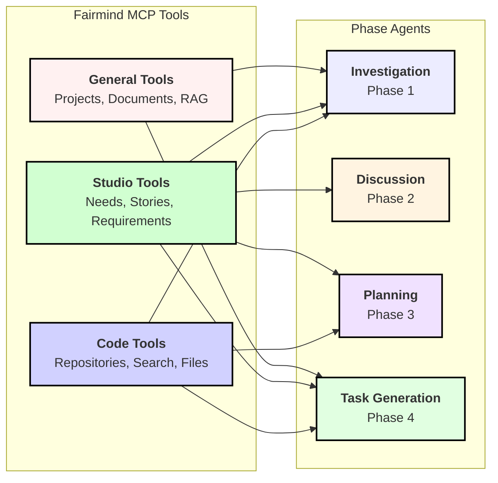
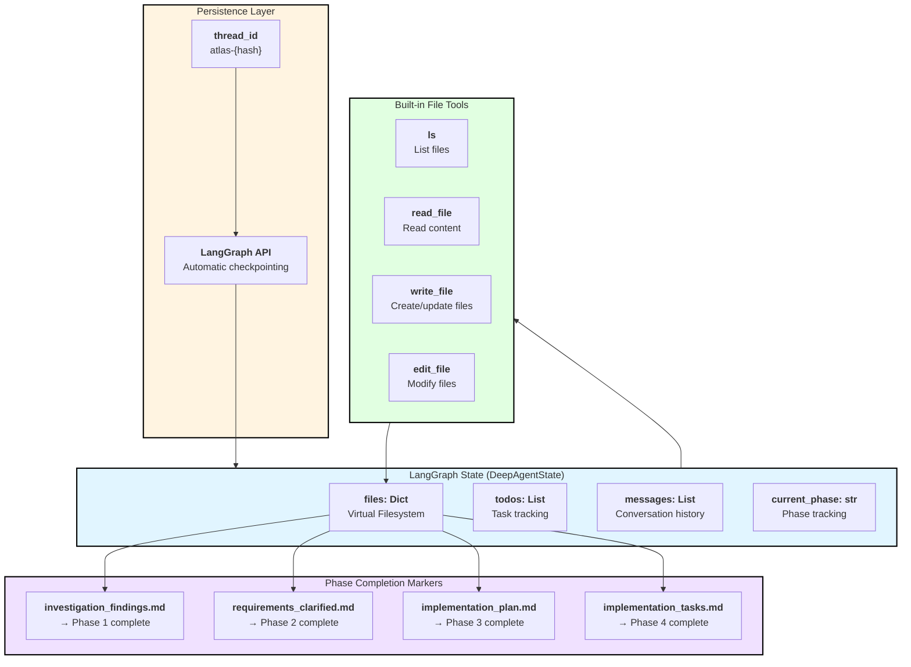
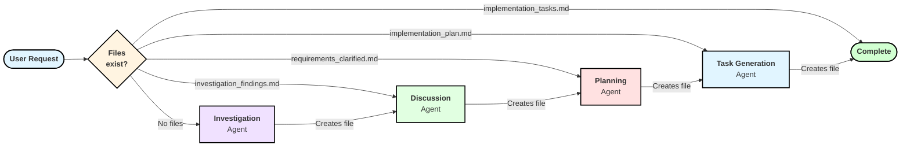

# Atlas V1 Architecture Documentation

**Version:** 1.1
**Last Updated:** October 2024
**Purpose:** Technical planning agent implementing 4-phase methodology

---

## Overview

Atlas V1 is a sophisticated AI agent that transforms user stories into actionable implementation plans through a structured 4-phase methodology. Built on the DeepAgents framework with LangGraph, it integrates with Fairmind MCP for project management capabilities.

### Core Principles

- **Phase Sequencing**: Strictly enforced investigation → discussion → planning → task generation flow
- **Tool Isolation**: Each phase receives only the MCP tools it needs (principle of least privilege)
- **Delegation Pattern**: Hierarchical agent architecture with specialized sub-agents
- **Stateless Agents**: Virtual filesystem enables context preservation across phases
- **User Collaboration**: Strategic human-in-the-loop checkpoints for validation

---

## 1. System Architecture



### Architecture Layers

**Entry Layer**: User-facing interface that creates LangGraph-compatible agent instances

**Orchestration Layer**: Lightweight coordinator (~350 lines) that manages phase transitions and agent delegation

**Agent Layer**: Four specialized phase agents, each focused on a specific aspect of planning methodology

**Sub-Agent Layer**: Dynamic repository analyzers spawned by Planning Agent for parallel code analysis

**Integration Layer**: MCP client for external tool access and virtual filesystem for state management

**External Systems**: Fairmind MCP server providing project management and code analysis capabilities

---

## 2. Phase Flow

```mermaid
stateDiagram-v2
    [*] --> Investigation

    state Investigation {
        [*] --> LoadContext
        LoadContext --> ExploreProject: Use MCP tools
        ExploreProject --> AnalyzeStories: General/Studio/Code
        AnalyzeStories --> IdentifyGaps
        IdentifyGaps --> SaveFindings
        SaveFindings --> [*]: investigation_findings.md
    }

    Investigation --> Discussion: Findings complete

    state Discussion {
        [*] --> ReadFindings
        ReadFindings --> GenerateQuestions: Business focus only
        GenerateQuestions --> AskUser: human_input tool
        AskUser --> SynthesizeReqs: Collect responses
        SynthesizeReqs --> ApproveReqs: approve_plan tool
        ApproveReqs --> SaveRequirements
        SaveRequirements --> [*]: requirements_clarified.md
    }

    Discussion --> Planning: Requirements approved

    state Planning {
        [*] --> DiscoverRepos
        DiscoverRepos --> SpawnAnalyzers: Parallel sub-agents
        SpawnAnalyzers --> AnalyzeCode: Code MCP tools
        AnalyzeCode --> SynthesizeAnalysis
        SynthesizeAnalysis --> PresentSolution: approve_plan tool
        PresentSolution --> CreatePlan
        CreatePlan --> [*]: implementation_plan.md
    }

    Planning --> TaskGeneration: Plan approved

    state TaskGeneration {
        [*] --> ReadPlan
        ReadPlan --> MapRepositories: 1:1 task-repo mapping
        MapRepositories --> GenerateTasks
        GenerateTasks --> ValidateMatrix
        ValidateMatrix --> SaveTasks
        SaveTasks --> [*]: implementation_tasks.md
    }

    TaskGeneration --> [*]: Workflow complete
```



### Phase Transitions

**File-Based Detection**: Phase completion is determined by the presence of specific output files in the virtual filesystem

**Auto-Advance Phases**: Investigation and Task Generation advance automatically upon completion

**Interactive Phases**: Discussion and Planning require user approval via `approve_plan` or `human_input` tools

**Phase Validation**: Each phase must produce expected output files before the next phase can begin

---

## 3. Agent Interactions



### Interaction Patterns

**Orchestrator Role**: Pure coordination - delegates all work to specialized agents via `task` tool

**Agent Autonomy**: Each phase agent operates independently with its own tools and objectives

**Parallel Execution**: Planning phase spawns multiple repository analyzers that run concurrently

**Human Checkpoints**: Strategic user interaction at Discussion (requirements) and Planning (solution) phases

**State Sharing**: All agents read/write to shared virtual filesystem for context continuity

---

## 4. MCP Tool Usage Patterns



### Tool Filtering Strategy

| Phase | MCP Tools | Rationale | Critical Tools |
|-------|-----------|-----------|----------------|
| **Investigation** | General + Studio + Code | Complete project exploration and context gathering | `list_projects`, `get_user_story`, `list_repositories` |
| **Discussion** | Studio only | Requirements clarification focused on business needs | `get_user_story`, `list_needs_by_project` |
| **Planning** | Code + Studio | Technical analysis and code repository exploration | `Code_search`, `Code_cat`, `Code_tree` |
| **Task Generation** | General + Studio + Code | Comprehensive task creation with full context | All tools for validation and cross-reference |

### Tool Isolation Benefits

**Security**: Phases cannot access tools outside their scope, preventing unintended operations

**Efficiency**: Smaller tool sets reduce token usage and improve response times

**Clarity**: Explicit tool assignments make agent capabilities transparent

**Maintainability**: Tool changes affect only specific phases, not the entire system

---

## 5. State Management



### State Architecture

**Virtual Filesystem**: Flat key-value store (`Dict[str, str]`) managed by LangGraph state, no nested directories

**Phase Detection**: Orchestrator checks file existence to determine current phase and completion status

**Automatic Persistence**: LangGraph API handles state checkpointing via `thread_id` - no manual saving required

**Stateless Agents**: Each agent reads context from virtual files and writes outputs back - no internal state needed

**Thread Continuity**: Consistent `thread_id` across all phases enables state preservation through the entire workflow

### File-Based Workflow Control



---

## 6. Key Design Patterns

### Delegation Pattern

**Orchestrator** → never executes tasks directly, only coordinates
**Phase Agents** → execute phase-specific work, may delegate to sub-agents
**Sub-Agents** → perform specialized analysis (e.g., repository-specific code analysis)

### Tool Filtering Pattern

Each phase receives precisely the tools it needs through filtering functions:
- `get_investigation_tools(mcp_tools)` → General + Studio + Code
- `get_discussion_tools(mcp_tools)` → Studio only
- `get_planning_tools(mcp_tools)` → Code + Studio
- `get_task_generation_tools(mcp_tools)` → All tools

### File-as-Contract Pattern

Expected output files serve as completion contracts:
- Agents know what files to create
- Orchestrator knows what files to check
- Users can inspect intermediate outputs
- Phase transitions are explicit and verifiable

### Hierarchical Sub-Agent Pattern

Planning Agent dynamically creates repository-specific analyzers:
```
planning-agent
├── repository-analyzer-backend
├── repository-analyzer-frontend
└── repository-analyzer-mobile
```

Each analyzer inherits Code tools but operates independently on its assigned repository.

---

## 7. Critical Configuration

### Environment Variables

```bash
# Core API
ANTHROPIC_API_KEY=sk-ant-...

# MCP Fairmind Integration
FAIRMIND_MCP_URL=https://project-context.mindstream.fairmind.ai/mcp/mcp/
FAIRMIND_MCP_TOKEN=your_token_here

# Optional Model Overrides
ATLAS_MODEL_NAME=claude-sonnet-4-20250514
ATLAS_MODEL_TEMPERATURE=0.7
ATLAS_MODEL_MAX_TOKENS=8192

# LangSmith Tracing (Optional)
LANGCHAIN_TRACING_V2=true
LANGCHAIN_PROJECT=deepagents-atlas
LANGCHAIN_API_KEY=lsv2_pt_...
```

### Safety Controls (config.yaml)

- **max_retries**: 3 attempts for failed tool calls
- **max_tokens_per_phase**: 50,000 token limit per phase
- **timeout_minutes_per_phase**: 10-minute timeout
- **circuit_breaker_errors**: Stop after 5 consecutive errors
- **enable_cost_monitoring**: Token usage logging

---

## 8. Execution Flow Summary

```mermaid
graph TD
    Start(["<b>User Request</b><br/>Analyze US-123"]) --> Entry["<b>atlas_agent.py</b><br/>Create LangGraph agent"]

    Entry --> Coord["<b>AtlasCoordinator</b><br/>Initialize with MCP tools"]

    Coord --> Phase1{"<b>Phase 1</b><br/>Investigation"}
    Phase1 --> |MCP: General+Studio+Code| Inv["<b>Silent project exploration</b>"]
    Inv --> |Output| F1["<b>investigation_findings.md</b>"]

    F1 --> Phase2{"<b>Phase 2</b><br/>Discussion"}
    Phase2 --> |MCP: Studio<br/>Tool: human_input| Disc["<b>Interactive requirements</b>"]
    Disc --> |User approval| F2["<b>requirements_clarified.md</b>"]

    F2 --> Phase3{"<b>Phase 3</b><br/>Planning"}
    Phase3 --> |MCP: Code+Studio| Plan["<b>Repository analysis</b>"]
    Plan --> |Parallel sub-agents| RA["<b>Repository Analyzers</b>"]
    RA --> |Synthesize| Synth["<b>Create solution</b>"]
    Synth --> |User approval| F3["<b>implementation_plan.md</b>"]

    F3 --> Phase4{"<b>Phase 4</b><br/>Task Generation"}
    Phase4 --> |MCP: All tools| Task["<b>Generate tasks</b>"]
    Task --> |1:1 repo mapping| F4["<b>implementation_tasks.md</b>"]

    F4 --> Complete(["<b>Workflow Complete</b><br/>Return artifacts"])

    style Start fill:#e1f5ff,stroke:#000,stroke-width:2px
    style Entry fill:#fff4e1,stroke:#000,stroke-width:2px
    style Coord fill:#f0e1ff,stroke:#000,stroke-width:2px
    style Phase1 fill:#e1ffe1,stroke:#000,stroke-width:2px
    style Phase2 fill:#ffe1e1,stroke:#000,stroke-width:2px
    style Phase3 fill:#e1f5ff,stroke:#000,stroke-width:2px
    style Phase4 fill:#fff4e1,stroke:#000,stroke-width:2px
    style Complete fill:#d1ffd1,stroke:#000,stroke-width:2px
```



---

## 9. Architecture Strengths

✅ **Modular Design**: Clear separation of concerns across layers and phases
✅ **Tool Isolation**: Principle of least privilege enhances security and efficiency
✅ **Stateless Agents**: Virtual filesystem enables clean agent design
✅ **Parallel Execution**: Repository analyzers run concurrently in planning phase
✅ **User Collaboration**: Strategic human checkpoints ensure alignment
✅ **Framework Integration**: Built on proven DeepAgents + LangGraph foundation
✅ **Extensibility**: Easy to add new phases or modify existing agent behavior

---

## 10. Common Workflows

### Standard User Story Analysis

1. User provides story ID and project context
2. Investigation autonomously gathers business requirements
3. Discussion clarifies ambiguities with user (business focus)
4. Planning analyzes code repositories with parallel sub-agents
5. Task generation creates actionable implementation tasks
6. User receives complete implementation plan

### Repository-First Analysis

1. User specifies repositories to analyze
2. Planning phase discovers repository structure
3. Parallel analyzers explore each repository
4. Cross-repository dependencies identified
5. Integrated implementation plan created

### Iterative Refinement

1. Initial plan generated through 4 phases
2. User requests modifications at any phase
3. Coordinator re-runs affected phases
4. Virtual filesystem preserves completed work
5. Only modified phases re-execute

---

## Conclusion

Atlas V1 demonstrates a sophisticated multi-agent architecture that balances **autonomy** (silent investigation), **collaboration** (interactive discussion), **efficiency** (parallel analysis), and **safety** (tool isolation). The file-based state management and phase detection create a simple yet robust orchestration mechanism.

The system's modularity and clear separation of concerns make it highly maintainable and extensible, while the integration with Fairmind MCP provides powerful project management capabilities.

**Key Insight**: By treating file creation as phase completion contracts and using virtual filesystem for state management, Atlas V1 achieves stateless agent design with full context preservation - a clean solution to the challenge of multi-phase AI workflows.
